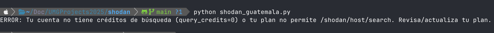
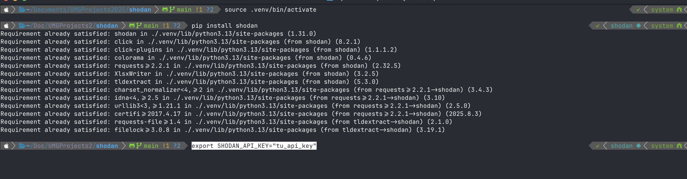

# Shodan Guatemala Script

Este proyecto contiene un script en Python que utiliza la API de Shodan para consultar dispositivos en Guatemala y mostrar un resumen de los resultados.

## Entorno y compatibilidad
Este software fue desarrollado y probado en una MacBook Air con chip Apple Silicon (M2) y sistema operativo macOS. El entorno virtual de Python se creó usando las herramientas estándar de Python 3, asegurando compatibilidad con arquitecturas ARM/M1/M2.

### Pasos iniciales realizados
1. Se creó un entorno virtual de Python:
	```sh
	python3 -m venv .venv
	```
2. Se activó el entorno virtual:
	```sh
	source .venv/bin/activate
	```
3. Se instaló el paquete Shodan:
	```sh
	pip install shodan
	```
4. Se desarrolló el script principal `shodan_guatemala.py`.
5. Se configuró la clave API de Shodan en el script o como variable de entorno.

Estos pasos aseguran que el proyecto funcione correctamente en equipos Mac con chip Silicon y también en otras plataformas compatibles con Python 3.

## Descripción
El script realiza una búsqueda en Shodan filtrando por el país Guatemala (`country:"GT"`), muestra todas las IPs encontradas junto con sus puertos abiertos y genera un resumen con:
- Total de direcciones IP identificadas
- Total de IPs por puerto abierto
- Datos del estudiante (carnet, nombre, curso y sección)

## Requisitos
- Python 3
- Paquete `shodan` instalado (`pip install shodan`)
- Clave API válida de Shodan

## Uso
1. Configura tu clave API en el script o como variable de entorno `SHODAN_API_KEY`.
2. Ejecuta el script:
	```sh
	python shodan_guatemala.py
	```

### Cómo exportar la clave API de Shodan
Para mayor seguridad, puedes exportar tu clave API como variable de entorno en tu terminal antes de ejecutar el script:

```sh
export SHODAN_API_KEY="tu_api_key_aqui"
```

Reemplaza `tu_api_key_aqui` por tu clave real. Así el script la detectará automáticamente sin necesidad de modificar el código.

## Ejemplo de salida de error
Si tu cuenta no tiene créditos de búsqueda o tu plan no permite el endpoint, verás un mensaje como el siguiente:


## Ejecucion 


## Autor
- Carnet: [TU CARNET]
- Nombre: Samuel Atz
- Curso: Seguridad Informática
- Sección: [TU SECCIÓN]